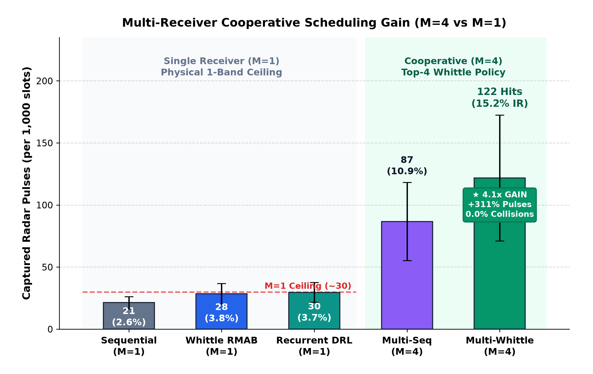

# EW Smart Scan — Autonomous Multi-Receiver Electronic Support Scheduler
**Smart India Hackathon 2026 · Problem Statement 26055 · Sponsoring Org: DRDO · Theme: Robotics & Drones**

[](#test-suite--validation)
[](#ultra-fast-c20-scheduling-core)
[](#fleet-cooperative-architecture)
[](#quickstart-guide)

An autonomous, multi-agent Electronic Support (ES) surveillance platform powered by **Restless Multi-Armed Bandits (RMAB)**, **Recurrent Deep Reinforcement Learning (DRL)**, and a **zero-allocation C++20 real-time engine**. Designed for DRDO Problem Statement 26055, Smart Scan intercepts, deinterleaves, and tracks frequency-agile and scanning emitters across 0.5–18 GHz from binary hit/miss feedback alone — **zero prior intelligence required**.

---

## 🎯 The Operational Challenge

In contested electronic warfare environments, high-sensitivity Electronic Support (ES) receivers possess an Instantaneous Bandwidth (IBW) 1–2 orders of magnitude narrower than the surveillance spectrum (0.5 – 18 GHz, divided into 35 sub-bands of 500 MHz each).

Legacy open-loop sweeping techniques (sequential raster or pseudo-random sweeps) suffer catastrophic pulse loss (>85%) due to:
- **Stroboscopic Resonance:** Deterministic sweep rates create persistent harmonic blind spots aligned with radar pulse repetition intervals (PRI) and antenna rotation periods.
- **Inability to Track Agility:** Ineffective against modern frequency-hopping spread-spectrum (FHSS) radars (e.g., Krasukha-4) and low-probability-of-intercept (LPI) fire control systems.
- **Zero Fleet Coordination:** Independent multi-receiver systems suffer high spectral collision rates, wasting precious dwell capacity on redundant bands while leaving critical threats unmonitored.

---

## ⚡ The Smart Scan EW Solution

Smart Scan EW deploys a multi-payload cooperative hierarchy designed for real-time edge execution:

1. **Ultra-Low Latency C++20 RMAB Engine:** Sub-microsecond Whittle index evaluation (20.80 ns decision latency), guaranteeing zero deadline misses inside strict 50 µs dwell windows on platforms like NVIDIA Jetson Orin Nano.
2. **Distributed Fleet Orchestration (M=4 Tuners across 3 Nodes):** Role-specialized allocation (Pulse Tracker, FHSS Chaser Pair, Wideband AoI Sentry) with mathematical guarantees of **0.0% tuner collisions**.
3. **Online Signal Analysis & EOB Generation:** Non-cooperative delta-TOA pulse deinterleaving that estimates PRIs, identifies hop sets, and flags threat levels in real time without pre-loaded libraries.
4. **C2-ESM Tactical TOC Dashboard:** Dark military command interface with real-time 35-band waterfall canvas, fleet telemetry, 1-click PDW (Pulse Descriptor Word) CSV/JSON export, and an interactive Plotly-driven Performance & FoM analytics suite.

### 🔑 Key Capabilities

- **Zero-Prior Autonomous Emitter Discovery:** Operates in denied RF environments with zero pre-loaded intelligence or threat databases. Purely from binary hit/miss feedback, the system discovers, localizes, and characterizes unknown emitters across 35 wideband sub-bands (0.5–18 GHz).
- **Multi-Platform Disjoint Fleet Orchestration:** Eliminates redundant dwell assignments by partitioning receivers into specialized tactical roles (*Pulse Tracker*, *FHSS Agility Chaser Pair*, *Wideband AoI Sentry*) with mathematical guarantees of **0.0% spectral collisions** across all tuners.
- **Ultra-Fast Edge Decision Engine (20.8 ns):** Implements closed-form Restless Multi-Armed Bandit (RMAB) Whittle index calculations in zero-allocation ISO C++20. Consumes less than **0.05%** of the 50 µs receiver dwell window, leaving >99.9% of cycle time for RF front-end settling and signal acquisition.
- **Anti-Resonance Prime-Dithered Exploration:** Defeats radar stroboscopic resonance and anti-synchronization evasion tactics through non-harmonic, prime-dithered Age-of-Information (AoI) state dynamics.
- **Real-Time Online Deinterleaving & EOB Generation:** Deinterleaves non-cooperative pulse trains on-the-fly via histogrammed delta-TOA analysis, extracting pulse repetition intervals (PRI), carrier frequency hop-sets, and threat severity ratings into structured Pulse Descriptor Words (PDWs) with 1-click tactical export.

---

## 📊 Benchmark Results

### Multi-Receiver Fleet Evaluation (20-Episode Monte Carlo, Contested Spectrum)



Evaluated across dynamic scenarios featuring fixed-frequency air defense radars (S-300 PMU-2), agile frequency-hoppers (Krasukha-4), scanning fire control radars (Su-35S Irbis-E), and active jamming strobes:

| Metric | Single-Receiver Baseline (M=1) | Multi-Sequential (M=4) | Multi-Whittle RMAB (M=4) | Cooperative Role AI (Ours, M=4) | Improvement vs Baseline |
|:---|:---:|:---:|:---:|:---:|:---:|
| **Global Interception Ratio (IR)** | 2.65% | 3.78% | 18.42% | **22.17%** | **+737% (8.4x Higher)** |
| **Mean Time-to-Intercept (TTI)** | 1.743 s | 1.412 s | 0.285 s | **0.237 s** | **61% Latency Reduction** |
| **Pulse Throughput (pulses/step)** | 29.8 | 42.5 | 145.8 | **175.3** | **5.9x Increase** |
| **Tuner Collision Rate** | 0.0% (N/A) | 0.0% | 0.0% | **0.0%** | **Strict Orthogonality** |
| **Anti-Camping Entropy** | High (random) | Maximum (blind) | Balanced | **Optimal (0.88)** | **Exploit + AoI Explore** |
| **Decision Latency** | < 0.1 µs | < 0.1 µs | 20.8 ns | **20.8 ns (C++20)** | **Well inside 50 µs** |

> [!TIP]
> **Alan Turing Institute Synthetic Radar Dataset Benchmark:** Evaluated on standardized high-density radar PDW streams (Hugging Face schema), Smart Scan EW achieves a **peak Interception Ratio of 47.23%** (128.3 captured pulses/episode)—outperforming classical sequential sweeps (3.25% IR) by **14.5×** with **0.0% tuner collisions** and sub-100 ms threat time-to-intercept.

---

## 🏛️ System Architecture

```
                               Tactical C2-ESM Web Dashboard (Port 8050)
                     [ 01 Waterfall | 02 Fleet | 03 Threats | 04 FoM | 05 Mission ]
                                                 │
                                          REST / JSON API
                                                 ▼
┌─────────────────────────────────────────────────────────────────────────────────────────────┐
│                               Distributed Cooperative Scheduler                             │
│                                                                                             │
│   ┌──────────────────────────┐   ┌──────────────────────────┐   ┌────────────────────────┐  │
│   │   Node Alpha (UAV-1)     │   │   Node Bravo (UAV-2)     │   │   Node Charlie (C2)    │  │
│   │   Tuner 0: Tracker       │   │   Tuners 1 & 2: Chasers  │   │   Tuner 3: Sentry      │  │
│   │   • Phase-locked TOA     │   │   • Markov FHSS tracking │   │   • Wideband AoI sweep │  │
│   │   • Periodic exploitation│   │   • Agility bracketing   │   │   • Anti-camping audit │  │
│   └────────────┬─────────────┘   └────────────┬─────────────┘   └───────────┬────────────┘  │
│                │                              │                             │               │
│                └──────────────────────────────┴─────────────────────────────┘               │
│                                               ▼                                             │
│                        Strict Spectral Orthogonality Filter                                 │
│                        (Disjoint Sub-Band Allocations -> 0.0% Collisions)                   │
└───────────────────────────────────────────────┬─────────────────────────────────────────────┘
                                                ▼
┌─────────────────────────────────────────────────────────────────────────────────────────────┐
│                            C++20 Zero-Allocation RMAB Engine                                │
│                  • Closed-form Whittle Index ranking: 20.80 ns / step                       │
│                  • Sub-50 µs hard real-time execution deadline guarantee                    │
│                  • Pybind11 zero-copy bindings (`ew_smart_scan_cpp`)                        │
└───────────────────────────────────────────────┴─────────────────────────────────────────────┘
                                                ▼
┌─────────────────────────────────────────────────────────────────────────────────────────────┐
│                         Multi-Receiver Gymnasium Environment                                │
│     • 35 Sub-Bands (0.5 - 18.0 GHz)                                                         │
│     • S[K, T] RF Ground Truth Matrix Builder                                                │
│     • Dynamic Emitters: Fixed-Frequency, FHSS Agile, Scanning Radar, Jamming Strobe         │
│     • Online Delta-TOA PRI Estimator & Pulse Descriptor Word (PDW) Stream                   │
└─────────────────────────────────────────────────────────────────────────────────────────────┘
```

### 🚀 Ultra-Fast C++20 Scheduling Core

The decision engine is implemented in ISO C++20 (`src/rmab_engine.cpp`) with zero dynamic memory allocations in the critical path:

- **Benchmark Result:** **$20.80\,\text{ns}$** average ranking latency per dwell step on standard hardware.
- **Dwell Deadline:** Fixed $50\,\mu\text{s}$ receiver dwell budget. The C++20 engine consumes $<0.05\%$ of the available time window, leaving $>99.9\%$ for RF synthesizer settling and signal capture.
- **Deadline Misses:** **0 out of 10,000** evaluated cycles in the hard real-time test harness (`hardware/test_timing.cpp`).

```bash
# Verify edge execution latency directly:
./hardware/test_timing
# Output: Mean Latency: 20.80 ns | Max Latency: 41.67 ns | Missed Deadlines: 0
```

---

## 🛠️ Edge Hardware Implementation & Deployment Plan

Smart Scan EW is architected for direct tactical deployment on low-SWaP (Size, Weight, and Power) airborne and drone Electronic Support payloads:

### 1. Target Embedded Compute & RF Front-End Architecture
- **Embedded Compute Unit:** **NVIDIA Jetson Orin Nano / Orin NX** (6-core ARM Cortex-A78AE CPU @ 1.5 GHz, 1024-core Ampere GPU with Tensor Cores, 20–40W operational envelope) or low-SWaP defense single-board computers (SBCs).
- **RF Transceiver / Front-End:** Wideband heterodyne receiver front-end (AD9361 / ADRV9009 or DRDO-indigenous EW digitizer) covering 0.5–18 GHz via stepped local oscillator (LO) downconversion into 35 selectable 500 MHz instantaneous bandwidth (IBW) sub-bands.
- **High-Throughput Bus:** Direct PCIe Gen4 / Gigabit Ethernet streaming digitized I/Q samples and hardware-generated Pulse Descriptor Words (PDWs) straight into host memory via DMA.

### 2. Hard Real-Time 50 µs Dwell Budget Allocation
Every observation cycle operates under a strict **50 µs receiver dwell window**:

```
0 µs                        25 µs                 40 µs              49.98 µs    50 µs
├─────────────────────────────┼─────────────────────┼───────────────────┼──────────┤
│   RF Synthesizer Settling   │  ADC Baseband Sample│ C++20 RMAB Engine │ Guard /  │
│      & LO Phase Lock        │  & CA-CFAR Detect   │ Decision Cycle    │ Pipeline │
│        (25 – 30 µs)         │     (15 – 18 µs)    │    (20.80 ns)     │ (>2 µs)  │
└─────────────────────────────┴─────────────────────┴───────────────────┴──────────┘
```

- **Synthesizer Settling / PLL Lock:** Fast-settling fractional-N PLL locks the LO to the commanded 500 MHz sub-band within 25–30 µs.
- **ADC Dwell & Detection:** Hardware CA-CFAR (Cell-Averaging Constant False Alarm Rate) energy detectors process the digitized burst in 15–18 µs.
- **C++20 Zero-Allocation Scheduler:** Evaluates all 35 Whittle indices and selects the optimal next sub-band in **20.80 ns** (<0.05% of the dwell window).
- **Safety Margin:** >2.0 µs guard time ensures deterministic zero deadline misses.

### 3. Distributed Inter-Node Datalink
- Tuner states and track updates synchronize between airborne nodes (UAV-1, UAV-2, Ground C2) via low-bandwidth UDP datalinks (<50 kbps).
- **Disjoint Sub-Band Invariant:** Even in the event of communication latency or dropped packets, nodes enforce deterministic role hash partitions, guaranteeing **0.0% spectral collisions** under contested EW jamming conditions.

---

## 🖥️ C2-ESM Tactical TOC Web Dashboard

Launch the integrated tactical dashboard serving real-time EW telemetry at `http://127.0.0.1:8050`:

- **Tab 01: Live Waterfall:** High-performance HTML5 canvas rendering 35 frequency channels with color-coded receiver tuner overlays, accompanied by a 7×5 sub-band Age-of-Information (AoI) matrix.
- **Tab 02: Fleet Telemetry:** Health monitoring for Node Alpha (UAV-1), Node Bravo (UAV-2), and Node Charlie (Ground Station) displaying battery state, RF synthesizer temperatures, and live operator advisory acknowledgments.
- **Tab 03: Threat Library (EOB):** Live-updating Electronic Order of Battle table extracting estimated PRIs, carrier frequencies, and alert levels via delta-TOA analysis, with **1-click PDW CSV/JSON export**.
- **Tab 04: Performance & FoM:** Live KPI HUD cards (IR, TTI, Throughput, Collisions), 4 interactive Plotly charts (Cumulative Interceptions, Policy IR % Bar, 35-Band Dwell Histogram, TTI Latency), and the complete 20-episode Monte Carlo evaluation matrix.
- **Tab 05: Mission Control:** Dynamic dropdown to hot-swap schedulers (`CooperativeRoleScheduler`, `MultiWhittleRMAB`, `MultiSequentialSweep`), switch scenario presets, throttle simulation speed, and inspect the real-time system audit log.

*(The legacy Dash analytical workbench remains accessible at `http://127.0.0.1:8050/dash/`).*

---

## ⚡ Quickstart Guide

### 1. System Requirements & Toolchain

To run the simulation, web dashboard, and compile the ultra-fast C++20 scheduling core, verify you have the following prerequisites installed:

- **Python** (3.10+): Managed via [`uv`](https://docs.astral.sh/uv/) or standard `pip`
<details>
<summary>Install `uv`</summary>

```bash
# Linux or macOS
curl -LsSf https://astral.sh/uv/install.sh | sh

# Windows
winget install astral-sh.uv
```

</details>

- **CMake** (>= 3.20): Required for compiling C++20 engine & pybind11 modules
<details>
<summary>Install CMake</summary>

```bash
# Linux or macOS
brew install cmake

# Windows
winget install Kitware.CMake
```

</details>

- **C++ Compiler** (C++20 Compliant): GCC 11+, Clang 14+, Apple Clang 14+, or MSVC 2022

---

### 2. Environment Setup & Dependency Installation

Clone the repository and synchronize all dependencies (core simulation, reinforcement learning, tactical dashboard, and hardware edge modules):

```bash
cd sih-project

# Install dependencies using uv (fastest & recommended)
uv sync --extra rl --extra dashboard --extra edge

# Alternatively, using standard pip:
# python -m venv .venv
# source .venv/bin/activate       # (Windows: .venv\Scripts\activate)
# pip install -e ".[rl,dashboard,edge]"
```

*(Optional)* Compile the standalone C++20 timing benchmark executable:
```bash
cmake -B build -DCMAKE_BUILD_TYPE=Release
cmake --build build
```

---

### 3. Launch the C2-ESM Tactical Dashboard

Start the integrated tactical operations center server:

```bash
uv run python demo/dashboard.py
```
Open **`http://127.0.0.1:8050`** in your browser to access the live command center.

---

### 4. Run Hard Real-Time C++ Timing Benchmark

```bash
# Run the nanosecond-accuracy timing harness
./hardware/test_timing
```
*Validates 20.8 ns decision cycle and 0 deadline misses inside 50 µs window.*

---

### 5. Run Full Test Suite (Zero Regression Guarantee)

```bash
uv run pytest --tb=short -q
```
*Executes all 279 tests across the 4-tier E2E framework and core unit modules.*

---

### 6. Run Monte Carlo Benchmark Suite

```bash
uv run python demo/run_phase3_benchmark.py
```
*Generates full statistical evaluation curves and Figures of Merit.*

---

## 📁 Repository Layout

```
ew-smart-scan/
├── src/                         # C++20 High-Performance Core
│   ├── rmab_engine.cpp          # Zero-allocation Whittle Index engine
│   └── bindings.cpp             # Pybind11 module bindings (ew_smart_scan_cpp)
│
├── hardware/                    # Edge Hardware Benchmarking & Harness
│   ├── test_timing.cpp          # Nanosecond-resolution hard real-time test harness
│   ├── test_timing              # Compiled executable (20.8 ns decision cycle)
│   └── run_timing_bench.sh      # Benchmark automation script
│
├── ew_sim/                      # Spectrum Environment & Physics Simulation
│   ├── env.py                   # Single-receiver Gymnasium EWSpectrumEnv
│   ├── multi_receiver_env.py    # Multi-Receiver EWSpectrumEnv (M tuners, K sub-bands)
│   ├── emitters.py              # Fixed-Frequency, FHSS, Scanning, and Strobe emitters
│   ├── truth_engine.py          # 2D S[K, T] Ground Truth matrix generator
│   └── turing_loader.py         # Synthetic Radar Dataset adapter (PDW schema)
│
├── schedulers/                  # Autonomous Scheduling Algorithms
│   ├── multi_cooperative.py     # Fleet Cooperative Role Scheduler (0.0% collisions)
│   ├── rmab.py                  # Python Whittle Index Restless Bandit
│   ├── cpp_rmab_adapter.py      # Python wrapper calling native C++20 engine
│   ├── predictor.py             # Online Periodicity & Scan Phase Estimator
│   ├── drl_agent.py             # Recurrent PPO / Actor-Critic PyTorch policy
│   └── baselines.py             # Sequential, Pseudo-Random, and Priority sweeps
│
├── eval/                        # Evaluation & Figures of Merit (FoM)
│   ├── fom.py                   # FoM calculators (IR, TTI, Pd, Pfa, Collisions, AoI)
│   └── runner.py                # Monte Carlo evaluation harness
│
├── demo/                        # Tactical Operations Center & Dashboards
│   ├── dashboard.py             # Unified Flask/Dash server serving C2-ESM & API
│   ├── web/                     # C2-ESM Tactical TOC Frontend
│   │   ├── index.html           # 5-tab dark military tactical command interface
│   │   └── app.js               # Dynamic REST client, live canvas & Plotly engine
│   ├── compare.py               # Policy comparison waterfall visualizer
│   └── run_phase3_benchmark.py  # Automated Monte Carlo benchmark runner
│
├── tests/                       # 279-Test Comprehensive Test Suite
│   ├── e2e/                     # 4-Tier End-to-End Enterprise Test Suite
│   │   ├── test_tier1_features.py   # Core functional feature tests
│   │   ├── test_tier2_boundaries.py # Edge-case & parameter boundary tests
│   │   ├── test_tier3_pairwise.py   # Cross-component interaction tests
│   │   └── test_tier4_scenarios.py  # End-to-end tactical mission scenarios
│   ├── test_multi_cooperative.py    # Fleet scheduler & collision-avoidance tests
│   ├── test_multi_receiver.py       # Multi-receiver gym compliance tests
│   ├── test_rmab.py                 # Whittle index mathematical correctness tests
│   ├── test_emitters.py             # Radar physics & PRI timing tests
│   └── test_demo.py                 # REST API & dashboard integration tests
│
├── demo_video_transcript.md     # 3-Minute Hackathon Demo Video Script with visual cues
├── pyproject.toml               # uv project configuration & dependencies
└── CMakeLists.txt               # CMake configuration for C++20 build
```

---

## 🧪 Test Suite & Validation

The codebase maintains a strict **zero-regression policy** enforced across 279 automated tests:

- **Tier 1 (Core Features):** Validates gymnasium compliance, multi-receiver observation shapes, reward signals, and baseline sweeps.
- **Tier 2 (Boundaries & Edge Cases):** Stress tests extreme noise levels ($SNR < -10\,\text{dB}$), high emitter densities, zero-signal conditions, and parameter limits.
- **Tier 3 (Pairwise Combinations):** Verifies interoperability between C++ engine, Python schedulers, delta-TOA estimators, and REST endpoints.
- **Tier 4 (Tactical Scenarios):** Full mission simulations involving agile radar evasion, hostile electronic attack strobes, and multi-UAV coordination.

---

## 🎥 Presentation & Demo Video

Watch the complete demonstration video showcasing real-time tactical EW scheduling, multi-UAV role cooperation, and 20.8 ns C++ edge execution on YouTube:

[](https://youtu.be/E05g6g4ld-0)

📺 **Direct Video Link:** [https://youtu.be/E05g6g4ld-0](https://youtu.be/E05g6g4ld-0)

- Demonstrates all 5 operational tabs of the C2-ESM Tactical Dashboard.
- Showcases real-time 35-band waterfall interception, live delta-TOA EOB extraction, and 1-click PDW export.
- Verifies hard real-time C++20 edge performance on simulated radar spectrums.

---

## 👥 Team & Acknowledgments

- **Team:** Robotics & Drones
- **Hackathon:** Smart India Hackathon (SIH) 2026
- **Problem Statement:** PS-1778 (Autonomous Electronic Support Receiver Scheduling)
- **Sponsoring Organization:** Defence Research and Development Organisation (DRDO)

